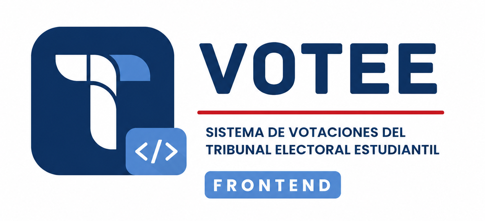
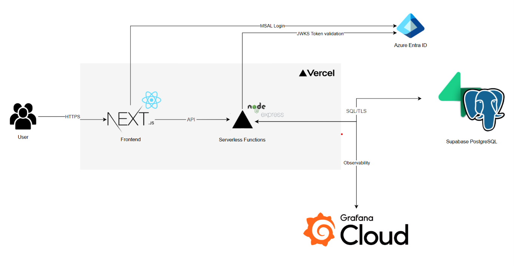

<div align="center">



# TEE Voting System - Frontend

Aplicación web de producción para el Tribunal Electoral Estudiantil del Instituto Tecnológico de Costa Rica. Reúne la experiencia del votante y la operación administrativa de una elección institucional en una interfaz clara, accesible y responsive.

[](https://nextjs.org/)
[](https://react.dev/)
[](https://www.typescriptlang.org/)
[](https://learn.microsoft.com/entra/identity-platform/msal-overview)
[](https://playwright.dev/)
[](https://github.com/JoseZum/sistema-electoral-frontend/actions/workflows/frontend-ci.yml)

**[Capacidades](#capacidades-principales) · [Arquitectura](#arquitectura) · [Instalación](#instalación) · [Calidad](#calidad) · [Backend](https://github.com/JoseZum/sistema-electoral-backend)**

</div>

---

## Capacidades principales

| Capacidad | Descripción |
| :-- | :-- |
| **Administración electoral** | Gestión de padrón, segmentos, elecciones, custodios y auditoría desde una consola protegida. |
| **Votación institucional** | Muestra únicamente elecciones habilitadas, valida papeletas simples o jerárquicas y confirma el voto después de una respuesta exitosa de la API. |
| **Monitoreo y escrutinio** | Seguimiento de participación, entregas de llaves, resultados y estados del proceso electoral. |
| **Evidencia institucional** | Exportación de padrón, auditoría y resultados en XLSX, PDF, DOCX y formato imprimible. |
| **Diseño para decisiones críticas** | Confirmaciones explícitas, estados electorales comprensibles y accesibilidad responsive para una jornada electoral real. |

## Arquitectura

El frontend usa **Next.js App Router**, MSAL y un cliente REST tipado. La autorización, las reglas electorales y la persistencia pertenecen al backend: el navegador no se conecta directamente a PostgreSQL.



Microsoft Entra ID autentica la identidad institucional. El backend valida el padrón y el rol antes de emitir la sesión utilizada por el frontend. La interfaz no decide permisos ni persiste secretos; los datos electorales se consultan y validan exclusivamente a través de la API.

```text
src/
├── app/          # rutas y layouts
├── components/   # UI compartida y componentes de dominio
├── lib/          # autenticación, API y exportaciones
└── types/        # contratos del dominio
```

## Instalación

### Requisitos

- Node.js 20 o superior.
- npm.
- El [backend del TEE Voting System](https://github.com/JoseZum/sistema-electoral-backend).
- Una aplicación registrada en Microsoft Entra ID para probar autenticación real.

```bash
cp .env.example .env.local
npm ci
npm run dev
```

La aplicación queda disponible en `http://localhost:3000` y espera la API en `http://localhost:3001` por defecto.

Consulta [`.env.example`](./.env.example) para el contrato completo. Las variables `NEXT_PUBLIC_*` forman parte del bundle del navegador y nunca deben contener secretos.

### Comandos habituales

```bash
npm run dev
npm run build
npm run lint
npm test
```

Los comandos especializados de Playwright, Lighthouse y seguridad están documentados en [`tests/README.md`](./tests/README.md).

## Calidad

La integración continua valida lint, tipos, pruebas unitarias, flujos Playwright, accesibilidad, Lighthouse y vulnerabilidades. Como gate final, ejecuta la suite E2E canónica del backend contra el commit actual del frontend, una API Express real y PostgreSQL.

Consulta [`tests/README.md`](./tests/README.md) para la estrategia de pruebas y [`tests/lighthouse/README.md`](./tests/lighthouse/README.md) para los presupuestos de calidad web.

## Tecnologías

- **Frontend:** Next.js, React, TypeScript, Tailwind CSS y Recharts.
- **Identidad:** Microsoft Entra ID y MSAL.
- **Documentos:** ExcelJS, jsPDF, AutoTable y docx.
- **Calidad:** Vitest, Playwright, Axe, Lighthouse y GitHub Actions.

## Repositorios relacionados

- [TEE Voting System — Backend](https://github.com/JoseZum/sistema-electoral-backend)
- [Pruebas y convenciones](./tests/README.md)

<div align="center">

Desarrollado en el **Instituto Tecnológico de Costa Rica**

</div>
