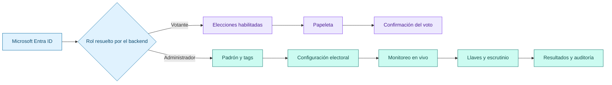
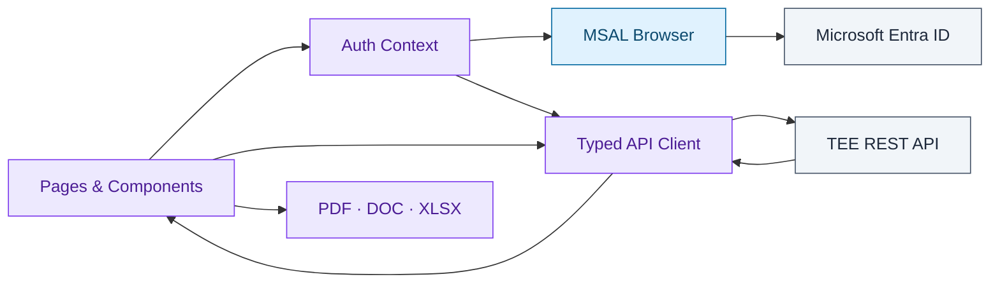

<div align="center">


# TEE Voting System · Frontend

### Una experiencia electoral institucional para administrar, observar y ejercer el voto con claridad.

Aplicación web de producción del **Tribunal Electoral Estudiantil del Instituto Tecnológico de Costa Rica**. Reúne en una sola interfaz el recorrido del votante y la operación completa del proceso electoral: padrón, segmentación, configuración, monitoreo, escrutinio, resultados y auditoría.

<br>

[](https://nextjs.org/)
[](https://react.dev/)
[](https://www.typescriptlang.org/)
[](https://tailwindcss.com/)

[](https://learn.microsoft.com/entra/identity-platform/msal-overview)
[](https://playwright.dev/)
[](https://developer.chrome.com/docs/lighthouse/)
[](https://github.com/JoseZum/sistema-electoral-frontend/actions/workflows/frontend-ci.yml)

<sub>App Router · MSAL · REST API · Responsive UI · Accessibility · PDF/DOC/XLSX · Lighthouse</sub>

<br><br>

**[Experiencia](#dos-experiencias-un-solo-proceso-electoral) · [Capacidades](#superficie-del-producto) · [Arquitectura](#arquitectura-del-frontend) · [Ejecución](#ponerlo-en-marcha) · [Calidad](#calidad-de-interfaz)**

</div>

---

## Dos experiencias, un solo proceso electoral

El producto separa deliberadamente la operación administrativa del acto de votar. Cada rol recibe únicamente el contexto, las decisiones y el nivel de detalle que necesita.

| Experiencia | Objetivo | Recorrido |
| :-- | :-- | :-- |
| **Votante** | Participar sin navegar complejidad administrativa. | Identidad institucional → elecciones habilitadas → papeleta → revisión → confirmación. |
| **Administrador TEE** | Operar el proceso completo desde una consola coherente. | Padrón → segmentos → elección → observación → escrutinio → resultados → evidencia. |



## Superficie del producto

### Operación administrativa

| Área | Capacidades |
| :-- | :-- |
| **Dashboard** | Indicadores globales, elecciones en curso, participación y actividad reciente. |
| **Padrón** | Búsqueda, filtros, paginación, edición, exportación e importación de archivos Excel. |
| **Tags** | Segmentación visual del padrón y edición de miembros mediante catálogos institucionales. |
| **Elecciones** | Listado, filtrado, cambios de estado y eliminación protegida según el ciclo electoral. |
| **Constructor electoral** | Creación guiada, selección de electores, opciones, subopciones, imágenes, voto blanco/nulo, horarios y revisión final. |
| **Monitoreo en vivo** | Participación, ritmo de votos, proyección, abstencionismo y actualización automática cada 30 segundos. |
| **Llaves de escrutinio** | Selección de custodios, generación de llaves y preparación del umbral requerido. |
| **Escrutinio** | Seguimiento de entregas, validación de llaves y finalización del proceso. |
| **Resultados** | Desglose por opción o cargo, participación, réplica de papeleta y exportación institucional. |
| **Administradores** | Alta, búsqueda y revocación de accesos administrativos. |
| **Auditoría** | Línea de tiempo, filtros, estadísticas, exportación y purga con confirmación explícita. |

### Experiencia del votante

- Presenta únicamente elecciones para las que la persona está habilitada.
- Distingue procesos próximos, abiertos, completados y cerrados.
- Soporta papeletas simples y papeletas jerárquicas por cargo.
- Explica si el sufragio es anónimo o nominal antes de votar.
- Requiere una selección válida por grupo cuando existen subopciones.
- Evita reenvíos accidentales y muestra confirmación únicamente después de que la API acepta el voto.
- Mantiene navegación por teclado y semántica accesible en tarjetas y controles.

### Documentos y evidencia

La interfaz no se limita a visualizar información: también produce artefactos utilizables durante la operación electoral.

| Formato | Uso |
| :-- | :-- |
| **XLSX** | Padrón filtrado y registros de auditoría estructurados. |
| **PDF** | Informe oficial de resultados listo para impresión. |
| **DOC** | Informe editable compatible con procesadores de texto. |
| **HTML de impresión** | Réplica de la papeleta, estadísticas, participación y folio de emisión. |

Los reportes respetan el modo de sufragio: en elecciones anónimas muestran participación por persona, pero no la opción elegida.

## Diseño para una jornada electoral real

La interfaz utiliza un sistema visual propio del TEE, no un conjunto de pantallas genéricas. La jerarquía tipográfica, los estados de elección, las confirmaciones y los mensajes operativos están diseñados para reducir ambigüedad bajo presión.

Principios aplicados:

- **Una acción crítica, una confirmación clara:** votar, eliminar, purgar o finalizar nunca se presentan como acciones silenciosas.
- **Estado antes que decoración:** badges, cronómetros y mensajes explican qué puede ocurrir en cada etapa.
- **Divulgación progresiva:** el constructor electoral divide decisiones complejas y mantiene un resumen visible.
- **Privacidad comprensible:** la diferencia entre sufragio anónimo y nominal se explica en lenguaje de producto.
- **Responsive por diseño:** navegación administrativa adaptable y experiencia del votante enfocada en dispositivos personales.
- **Accesibilidad verificable:** landmarks, nombres accesibles, estados ARIA, teclado, Axe y presupuestos Lighthouse.

## Arquitectura del frontend

La aplicación utiliza **Next.js App Router** y organiza las rutas por experiencia. La autenticación, el cliente HTTP y las transformaciones de documentos viven fuera de las páginas para mantener responsabilidades claras.

```text
src/
├── app/
│   ├── (dashboard)/       # consola protegida para administradores
│   ├── (voter)/           # elecciones y papeletas del votante
│   ├── page.tsx           # acceso institucional y redirección por rol
│   ├── providers.tsx      # composición de MSAL y sesión
│   └── globals.css        # sistema visual y estilos responsive
├── components/
│   ├── auth/              # acceso y estados de autenticación
│   ├── dashboard/         # navegación y shell administrativo
│   ├── elections/         # controles reutilizables de elecciones
│   ├── padron/            # importación, filtros, tabla y edición
│   ├── tags/              # badges, selectores y miembros
│   └── ui/                # primitivas compartidas
├── lib/
│   ├── auth-context.tsx   # sesión y resolución del flujo MSAL
│   ├── api-client.ts      # REST, JWT, uploads y errores tipados
│   ├── export-results.ts  # impresión PDF y documento editable
│   ├── audit-xlsx.ts      # exportación estructurada de auditoría
│   ├── padron-xlsx.ts     # exportación del padrón
│   └── ballot-replica.ts  # representación imprimible de la papeleta
└── types/                 # contratos de autenticación y dominio
```

### Flujo de datos



### Autenticación y sesión

1. MSAL redirige a Microsoft Entra ID con los scopes `openid`, `profile` y `email`.
2. El frontend obtiene el ID token y lo intercambia en `/api/auth/microsoft`.
3. El backend valida identidad, padrón y rol, y emite un JWT propio.
4. El cliente conserva sesión y usuario en `localStorage`.
5. `apiClient` adjunta el JWT como `Bearer` y normaliza errores HTTP o de red.
6. Las rutas redirigen según rol; el backend continúa siendo la frontera real de autorización.

La sesión estática disponible en localhost y bajo `navigator.webdriver` existe únicamente para pruebas automatizadas; no sustituye el flujo institucional en producción.

## Mapa de rutas

| Ruta | Rol | Propósito |
| :-- | :--: | :-- |
| `/` | Público | Inicio de sesión institucional y resolución de destino. |
| `/votaciones` | Votante | Elecciones disponibles y estado de participación. |
| `/votaciones/[id]` | Votante | Papeleta, validación de selección y emisión. |
| `/dashboard` | Admin | Resumen operativo. |
| `/padron` · `/padron/cargar` | Admin | Gestión, exportación e importación del padrón. |
| `/tags` | Admin | Segmentos reutilizables de votantes. |
| `/elecciones` · `/elecciones/crear` | Admin | Ciclo de vida y constructor electoral. |
| `/monitoreo` | Admin | Observación de participación y actividad. |
| `/generar-llaves` | Admin | Preparación de custodios y llaves. |
| `/escrutinio` · `/escrutinio/subir` | Admin | Entrega, progreso y finalización. |
| `/resultados` | Admin | Resultados consolidados y documentos. |
| `/admin-manager` | Admin | Gestión de administradores. |
| `/auditoria` | Admin | Evidencia y trazabilidad operativa. |

## Ponerlo en marcha

### Requisitos

- Node.js 20 o superior —el pipeline utiliza Node.js 22—.
- npm.
- El [backend del TEE Voting System](https://github.com/JoseZum/sistema-electoral-backend) disponible local o remotamente.
- Una aplicación registrada en Microsoft Entra ID para probar autenticación real.

### Desarrollo local

```bash
cp .env.example .env.local
npm ci
npm run dev
```

La aplicación queda disponible en `http://localhost:3000` y espera la API en `http://localhost:3001` por defecto.

### Variables de entorno

[`.env.example`](./.env.example) contiene la plantilla segura:

```env
NEXT_PUBLIC_AZURE_CLIENT_ID=<azure-app-client-id>
NEXT_PUBLIC_AZURE_TENANT_ID=<azure-tenant-id>
NEXT_PUBLIC_REDIRECT_URI=http://localhost:3000
NEXT_PUBLIC_API_URL=http://localhost:3001
```

| Variable | Propósito |
| :-- | :-- |
| `NEXT_PUBLIC_AZURE_CLIENT_ID` | Identificador público de la aplicación registrada en Microsoft. |
| `NEXT_PUBLIC_AZURE_TENANT_ID` | Tenant utilizado por MSAL. |
| `NEXT_PUBLIC_REDIRECT_URI` | Origen documentado para redirects locales y entornos de prueba. |
| `NEXT_PUBLIC_API_URL` | URL base del backend; se normaliza antes de cada solicitud. |

Las variables `NEXT_PUBLIC_*` forman parte del bundle del navegador. Nunca deben contener secretos, credenciales privadas ni tokens de servidor.

### Producción

```bash
npm run build
npm start
```

Para desplegar en Vercel:

1. Configura las variables públicas por ambiente.
2. Registra el dominio de producción como redirect URI en Microsoft Entra ID.
3. Configura `NEXT_PUBLIC_API_URL` con la API productiva.
4. Incluye el dominio del frontend en `CORS_ORIGIN` del backend.
5. Valida login, voto, exportaciones y rutas protegidas en Preview antes de promover.

## Calidad de interfaz

El frontend combina pruebas de comportamiento, navegador, accesibilidad y calidad percibida. Después de superar esas validaciones, el último gate reutiliza la suite E2E canónica del backend contra el commit actual del frontend, una API Express real y PostgreSQL 16.

| Capa | Herramienta | Cobertura |
| :-- | :-- | :-- |
| Estática | ESLint + TypeScript | Contratos, imports, reglas de React y compilación. |
| Unitarias | Vitest + Testing Library | Componentes, hooks, utilidades y flujos aislados. |
| Integración UI | Playwright | Auth, dashboard, elecciones, voto, llaves, escrutinio, resultados y auditoría. |
| Accesibilidad | Axe + ARIA assertions | Bloquea violaciones críticas en recorridos de navegador. |
| Calidad web | Lighthouse | Performance, accesibilidad, best practices y SEO por módulo. |
| Dependencias | `npm audit` | Bloquea vulnerabilidades altas y críticas en producción. |
| E2E sistémico | Suite Playwright del backend + Docker | Ejecuta todos los recorridos reales sobre frontend, backend y PostgreSQL antes de promover. |

Los presupuestos Lighthouse predeterminados exigen al menos:

| Categoría | Umbral |
| :-- | --: |
| Performance | 70 |
| Accessibility | 90 |
| Best Practices | 90 |
| SEO | 80 |

La automatización cubre login, dashboard, padrón, tags, elecciones, votación, monitoreo, administradores, escrutinio, resultados y auditoría. Los reportes HTML, trazas, capturas y logs de los contenedores se conservan como artefactos de diagnóstico.

La suite sistémica no se copia dentro de este repositorio. El workflow descarga `sistema-electoral-backend@main` y ejecuta su suite original con el commit exacto del frontend bajo prueba. Esto mantiene una sola fuente de verdad y evita que dos copias E2E evolucionen de forma diferente.

## Comandos que importan

| Comando | Propósito |
| :-- | :-- |
| `npm run dev` | Ejecuta Next.js en desarrollo con Webpack. |
| `npm run build` | Genera el build optimizado de producción. |
| `npm start` | Sirve la compilación de producción. |
| `npm run lint` | Analiza el repositorio con ESLint. |
| `npm run typecheck` | Valida TypeScript sin emitir archivos. |
| `npm run test:unit:ci` | Ejecuta las pruebas unitarias una vez. |
| `npm run test:unit:coverage` | Produce cobertura de las pruebas unitarias. |
| `npm run test:integration` | Ejecuta la suite de navegador con Playwright. |
| `npm run test:integration:smoke` | Ejecuta únicamente los recorridos marcados como smoke. |
| `npm run test:security` | Audita dependencias de producción. |
| `npm run test:lighthouse:smoke` | Audita las pantallas críticas. |
| `npm run test:lighthouse:full` | Audita todos los módulos funcionales. |

## Estructura de pruebas

```text
tests/
├── unit/                  # componentes, utilidades y flujos aislados
├── integration/browser/   # recorridos Playwright con API controlada
│   └── support/           # assertions compartidas de accesibilidad
├── lighthouse/            # auditorías completas por módulo
├── security/              # auditoría de dependencias
└── manual/                # escenarios backend-dependientes fuera del gate
```

La estrategia y las convenciones para extender las suites están documentadas en [`tests/README.md`](./tests/README.md) y [`tests/lighthouse/README.md`](./tests/lighthouse/README.md).

## Estado y responsabilidad

Este repositorio contiene la interfaz operativa del TEE Voting System. Los cambios deben conservar la separación de roles, la semántica accesible, los contratos con la API y la claridad de las acciones críticas.

La interfaz ayuda a ejecutar el proceso de forma segura, pero no reemplaza las garantías del backend, las restricciones de PostgreSQL ni los procedimientos institucionales que gobiernan cada elección.

<div align="center">

Desarrollado en el **Instituto Tecnológico de Costa Rica**

`prepare → publish → participate → scrutinize → communicate`

</div>
